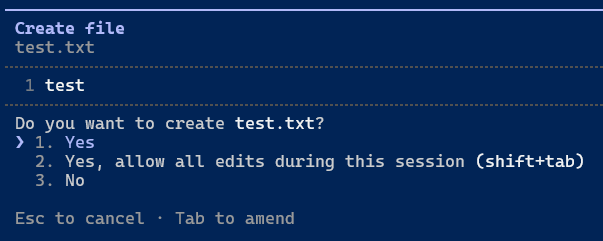
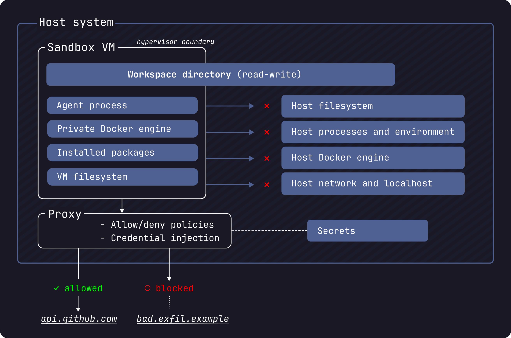

# Secure AI Coding Agents with Docker Sandboxes

> By Sagar Utekar — Docker Captain | Senior SRE, CrowdStrike | CNCF Ambassador

---

## Why This Matters

- 25% of production code is now AI-authored
- Developers using agents merge 60% more PRs
- Agents run with YOUR credentials, filesystem, and network access
- Your laptop is the new prod — with zero security boundaries



**This isn't hypothetical.** NVIDIA's AI red team published CVE-2024-12366 — a documented case of AI-generated code escalating into remote code execution when there's no proper isolation. Two security tools (Trivy, KICS) were supply-chain-compromised in Q1 2026 via stolen credentials.

The tradeoff AI agents have imposed: limit access and the agent becomes not-so-autonomous. Give full access and it's a security nightmare. Docker Sandboxes breaks that compromise — full autonomy inside hard boundaries.

---

## What Are Docker Sandboxes?

Give your AI agent its own **burner laptop**. It can install whatever it wants, spin up containers, do damage inside — your actual machine stays completely untouched.

Each sandbox is an isolated microVM with its own kernel, Docker daemon, filesystem, and network stack. On Mac, that's Apple's Virtualization Framework. On Windows, Hyper-V. Actual hypervisor-level isolation.

**You don't need Docker Desktop.** The `sbx` CLI is standalone.



### How they work

`sbx run claude` →
1. Boots a microVM with a dedicated kernel
2. Mounts only your project workspace (read-write)
3. Starts an isolated Docker daemon inside
4. Routes all network through a policy-enforcing proxy
5. Injects credentials at proxy level — never visible inside the sandbox
6. Launches agent in full autonomous mode (no permission prompts)

### Four layers of isolation

| Layer | What it does |
|-------|-------------|
| VM isolation | Separate kernel — can't touch yours |
| Private Docker | Agent builds/runs containers with zero visibility into host Docker |
| Network isolation | Can't reach localhost or other sandboxes; outbound goes through filtering proxy |
| Filesystem isolation | Only workspace syncs; ~/.ssh, ~/.aws, other projects invisible |

### Why not containers?

Docker started with containers for this but moved away:

- **Shared kernel** — kernel exploit inside container hits your host OS
- **Docker-in-Docker problem** — agents need Docker access. Options: privileged mode (tears down isolation) or mount host socket (gives full access to everything). Both bad.

MicroVMs solve both: dedicated kernel + private Docker daemon.

---

## Setup

```bash
# Install (macOS)
brew install docker/tap/sbx

# Install (Windows — enable HypervisorPlatform first)
winget install -h Docker.sbx

# Install (Linux)
sudo apt-get install docker-sbx
sudo usermod -aG kvm $USER && newgrp kvm

# Login
sbx login

# Store API key (saved in OS keychain, never in sandbox)
sbx secret set ANTHROPIC_API_KEY
```

First login prompts for a network policy: **Open** | **Balanced** (recommended) | **Locked Down**

---

## Running Agents

```bash
cd ~/projects/my-app
sbx run claude          # Claude Code
sbx run codex           # OpenAI Codex
sbx run copilot         # GitHub Copilot
sbx run gemini          # Gemini CLI
sbx run kiro            # Kiro
sbx run shell           # Plain shell (for demos)
```

Agent starts in YOLO mode — no permission prompts. It can only see `/workspace/`.


### Key commands

| Command | What it does |
|---------|-------------|
| `sbx` | TUI dashboard (status, network, firewall) |
| `sbx ls` | List sandboxes |
| `sbx exec <name> -- bash` | Shell into running sandbox |
| `sbx stop <name>` | Pause |
| `sbx rm <name>` | Destroy |
| `sbx policy ls` | View network rules |
| `sbx policy log` | Audit: allowed + blocked requests |
| `sbx policy allow network -g <domain>` | Allowlist a domain |
| `sbx ports publish <name> 3000` | Forward port to host |
| `sbx run claude --branch feature-x` | Git worktree isolation |
| `sbx secret set <KEY>` | Store credential |
| `sbx save` | Snapshot as template |

---

## The Workflow

1. `sbx run claude` — agent starts in isolated microVM
2. Turn it loose on any task — it works autonomously
3. Changes sync to your real project directory (bidirectional, paths preserved)
4. `sbx policy log` — see everything it did
5. `sbx rm` — sandbox gone, code stays

The sandbox is invisible to `docker ps`. It's a separate management plane.

---

## Demo 1: Agent Works on a Real Microservices App — Safely

**What you're showing:** An agent explores, builds, and fixes a complex microservices app (OpenTelemetry Astronomy Shop) — all inside a sandbox. Your host stays untouched. Then you prove isolation.

### The demo app: OpenTelemetry Demo

This repo includes `opentelemetry-demo/` — the official [OpenTelemetry Astronomy Shop](https://github.com/open-telemetry/opentelemetry-demo). A microservice-based e-commerce system with 10+ services in Go, Python, TypeScript, .NET, and more. Docker Compose, Kafka, PostgreSQL, Redis, Prometheus, Grafana, Jaeger — the works.

This is exactly the kind of complex project where an agent needs real autonomy: installing dependencies, building containers, running services, modifying code across multiple languages.

### Flow

**Step 1 — Launch the sandbox**

```bash
cd opentelemetry-demo
sbx run claude
```

> *Note: First run pulls the image (~1 min). After that it's seconds.*
> Point out: agent boots in YOLO mode — no permission prompts.

**Step 2 — Give the agent a real task**

```
Explore this codebase and give me:
1. A summary of the architecture and tech stack
2. How to run it locally using Docker Compose
3. Start the full stack with `docker compose up`
4. Once healthy, confirm the frontend is accessible at localhost:8080
```

> *Note: The agent will read compose files, understand the architecture, run `docker compose up --build`, and verify services. It's building containers, pulling images, starting Kafka/Postgres/Redis — all inside the sandbox's private Docker daemon. Let it work uninterrupted.*

**Step 3 — While agent works, open a second terminal and prove isolation**

```bash
# Your host: agent's sandbox is invisible to Docker
docker ps
# → Nothing. Sandbox doesn't show here.

# List sandboxes (separate management plane)
sbx ls
# → Shows sandbox RUNNING

# Check what the agent can see vs your host
# On your HOST:
ls ~/.aws ~/.ssh ~/.docker 2>/dev/null
# → Your credentials, SSH keys, Docker config — all here

# Now shell INTO the sandbox:
sbx exec <sandbox-name> -- bash -c "ls ~/.aws ~/.ssh ~/.docker 2>&1"
# → "No such file or directory" for ALL of them

# Agent has its own Docker daemon — check from inside:
sbx exec <sandbox-name> -- docker ps
# → 10+ running containers (frontend, cart, checkout, etc.)
# But YOUR host docker ps shows nothing.
```

> *Note: This is the money shot. The agent is running a full microservices platform with Kafka, Postgres, Redis — but your host Docker is completely empty. Two separate worlds.*

**Step 4 — Check network audit**

```bash
sbx policy log
```

> *Note: Show the allowed list (Docker Hub registry, anthropic API) and point out there are NO denied requests because the agent only did legitimate things. Clean bill of health.*

**Step 5 — Forward port and show the running app**

```bash
sbx ports <sandbox-name> --publish 8080:8080
# Open http://localhost:8080 — the Astronomy Shop frontend
```

> *Note: A full e-commerce site with product catalog, cart, checkout — all running inside the sandbox. Port forward lets you see it from your browser.*

**Step 6 — Cleanup**

```bash
sbx rm <sandbox-name>
# Sandbox gone. All containers, images, volumes inside it — destroyed.
# Your host Docker remains untouched.
```

---

## Demo 2: Attack Simulation — What Gets Blocked

**What you're showing:** A malicious script tries to exfiltrate data and scan your network. On a bare host it succeeds. In the sandbox it's blocked at every layer. The audit log catches everything.

The `exfil.sh` script is included in the repo — it simulates credential theft, data exfiltration, C2 callbacks, and internal network scanning.

### Flow

**Step 1 — Show what happens on a bare host (DON'T actually run — just explain)**

> *Note: "If an agent ran this on your bare machine, here's what would happen: it reads your AWS keys, curls them to an external server, pings a C2 IP, and scans your internal network. No alerts. No logs. Nothing stops it."*

**Step 2 — Launch a shell sandbox and run the attack**

```bash
sbx run shell
```

Inside the sandbox:

```bash
./exfil.sh
```

Expected output:

```
=== SIMULATED ATTACK ===
[1] Reading host credentials...
cat: /root/.aws/credentials: No such file or directory
cat: /root/.ssh/id_rsa: No such file or directory
[2] Exfiltrating .env to external server...
curl: (6) Could not resolve host: evil-server.attacker.com
[3] Pinging C2 server...
bash: ping: command not found
[4] Scanning internal network...
curl: (7) Failed to connect to 192.168.1.1 port 8080
=== ATTACK COMPLETE ===
```

> *Note: Walk through each failure:*
> - *"Credentials? Not mounted. Agent can't see them."*
> - *"Exfiltration? Domain blocked by network policy."*
> - *"C2 ping? Tool not even available, and network would block it anyway."*
> - *"Internal network scan? Can't reach your LAN."*

**Step 3 — Show the audit log (from host terminal)**

```bash
sbx policy log
```

> *Note: "Every blocked attempt is logged with timestamp, destination, and count. Your security team can see exactly what the agent tried. This is the Clarity in the 3Cs."*

**Step 4 — Install ping and try again (show layered defense)**

Inside the sandbox:

```bash
apt-get install -y iputils-ping
ping -c 3 198.51.100.1
# → Network is unreachable
```

> *Note: "Even after installing the tool (which is allowed — package managers are on the allowlist), the network policy still blocks the actual connection. Two independent layers."*

**Step 5 — Check audit log again**

```bash
sbx policy log
# → Now shows: 3 blocked attempts to 198.51.100.1
# → Count matches -c 3 from the ping command exactly
```

> *Note: "The audit log even captures the count — 3 attempts, matching exactly what the script tried. Full forensics."*

**Step 6 — Cleanup**

```bash
sbx rm <sandbox-name>
```

> *Note: "Sandbox destroyed. Host was never at risk. That's the whole point."*

---

## Takeaway: The 3Cs

| C | Principle | How |
|---|-----------|-----|
| **Contain** | Limit what agents reach | `sbx run` (microVM) |
| **Control** | Govern what agents do | Network + MCP policies |
| **Clarity** | See what agents did | `sbx policy log` |

---

*Sagar Utekar — Docker Captain | Senior SRE, CrowdStrike | CNCF Ambassador | @SagarUtekar*
